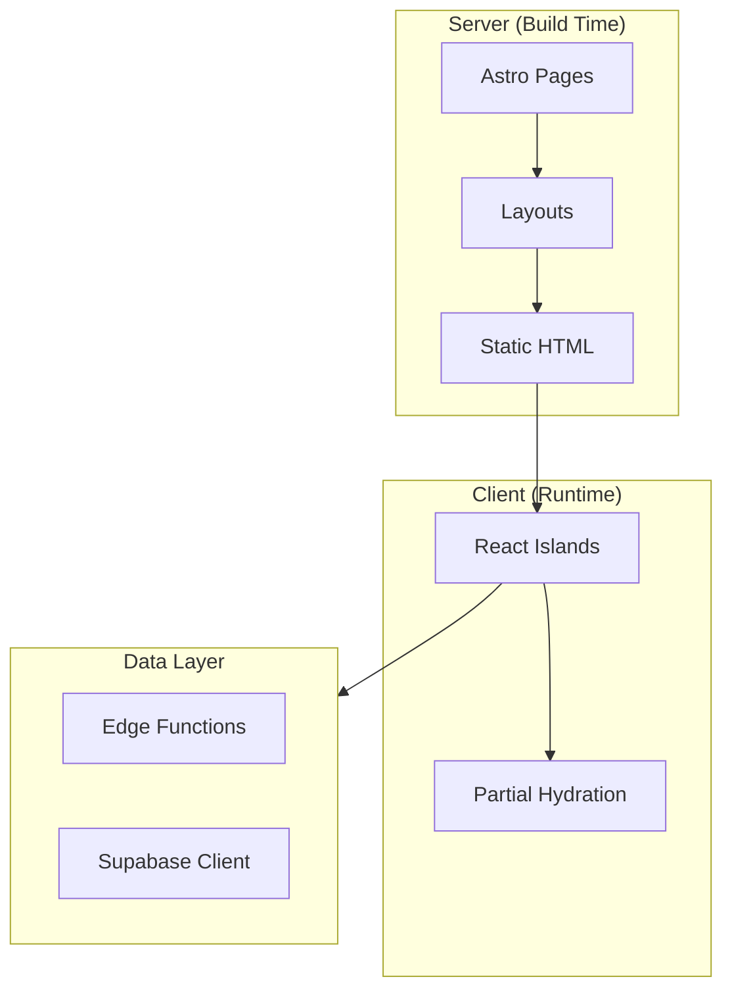
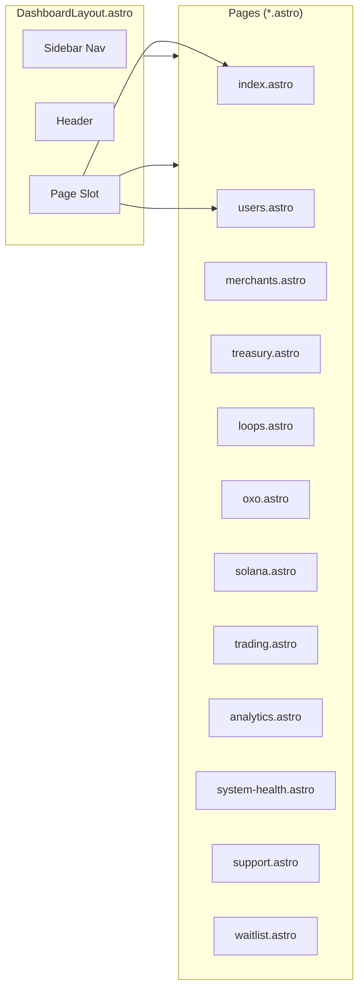
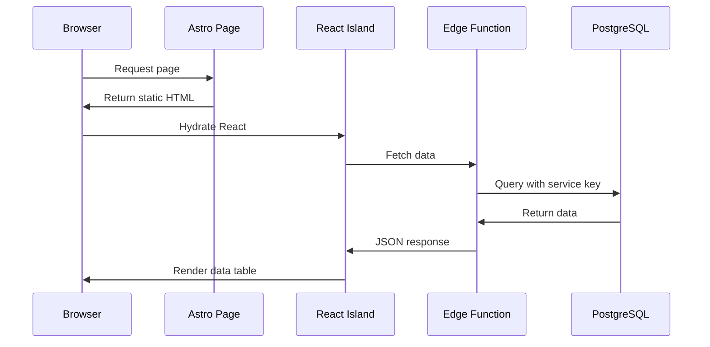
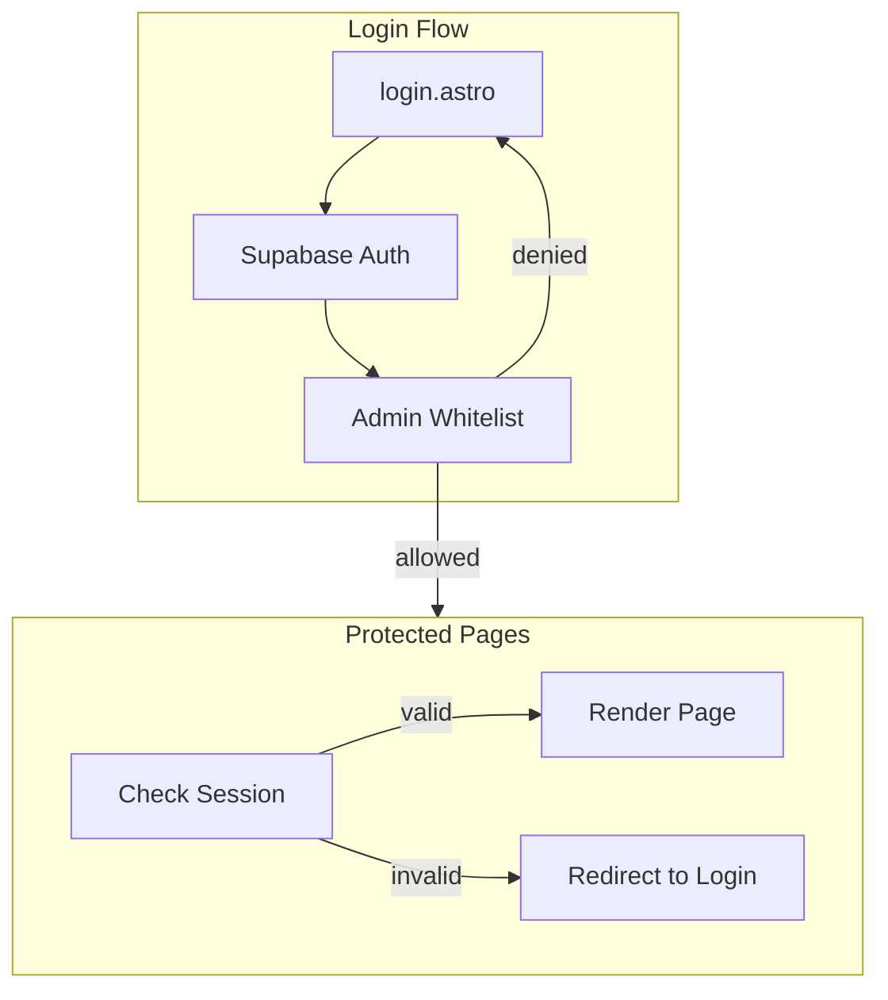
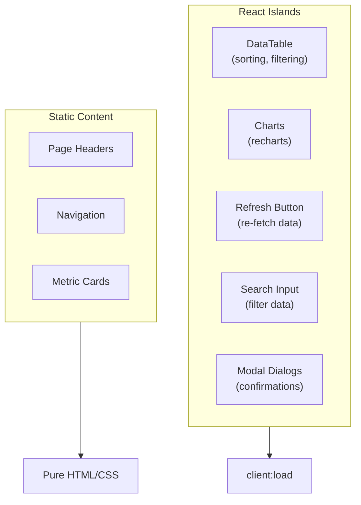
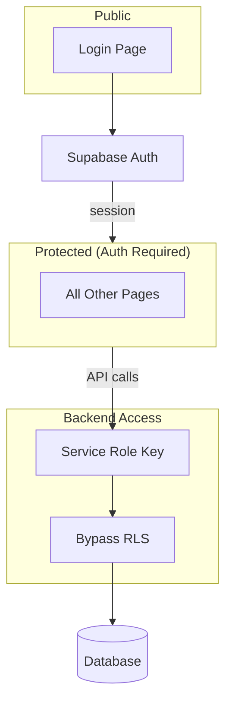

# Loop Command Center Architecture

## Astro Islands Architecture



## Page Structure



## Data Flow



## Authentication



## React Islands

Interactive components that hydrate on the client:



## Edge Function Integration

| Page | Edge Function | Data |
|------|---------------|------|
| Dashboard | `dashboard-status` | KPIs, totals |
| Users | `users-status` | User list, balances |
| Merchants | `merchants-status` | Merchant list, pools |
| Treasury | `treasury-action` | Balances, positions |
| Loops | `loops-status` | Loop metrics |
| OXO | `oxo-status` | Token metrics |
| Analytics | `analytics-status` | Growth data |
| Waitlist | `waitlist-status` | Signups |

## Security Model



## Design Tokens

```css
/* Command Center Dark Theme */
--bg-primary: #0f1419;
--bg-secondary: #1a1f26;
--bg-tertiary: #252b33;

--text-primary: #e7e9ea;
--text-secondary: #71767b;
--text-muted: #536471;

--accent-green: #00ba7c;
--accent-red: #f4212e;
--accent-blue: #1d9bf0;
--accent-gold: #ffd700;

--border: #2f3336;
--border-light: #3d4349;
```

## Build Output

```
dist/
├── index.html          # Dashboard
├── users/index.html    # Users page
├── merchants/...
├── treasury/...
├── _astro/
│   ├── client.xxxxx.js  # React islands bundle
│   └── hoisted.xxxxx.js # Shared JS
└── assets/
    └── styles.xxxxx.css # Tailwind output
```

Fully static output — can be served from any CDN.
